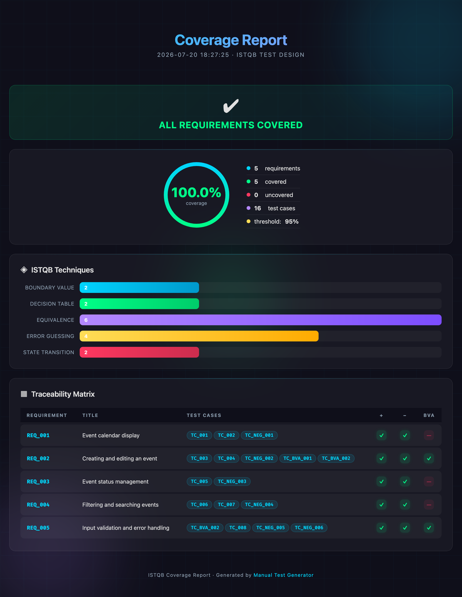

[English](README.md) | [Русский](README.ru.md) | 中文

# Manual Test Generator

一套工具链，用大语言模型把文字需求转换成手工测试用例，检查用例对需求的覆盖情况，并导出成 Allure TestOps 可以直接导入的 CSV。

仓库里的 Python 代码负责确定性的部分：解析需求、拼装提示词、校验模型生成的 YAML、统计覆盖率、写出 CSV。测试用例的文字内容由大语言模型产出。这里没有任何 API 客户端。生成过程由你自己已经在用的 LLM 命令行代理来驱动，`agent_rules.md` 则告诉这个代理该按什么顺序调用哪些脚本。

## 主要功能

- 需求就写成普通的 Markdown，标题加上要点列表，不需要额外学一套结构。
- 提示词模板要求模型套用 ISTQB Foundation Level 的五种测试设计技术，并给每条用例打上所用技术的标签。
- 覆盖率校验会生成需求到测试用例的追溯矩阵，覆盖率低于 95% 时校验失败。
- 导出的场景采用 Allure TestOps 认识的 `[step N]` / `[expected N]` 语法。
- 一份独立的 HTML 覆盖率报告，包含仪表盘、各技术的分布情况和完整矩阵。
- 增量写入。测试用例分小批到达，在进入缓冲区的路上完成校验和去重，只有在执行终结步骤时才成为正式输出文件。
- 检查点文件记录进度，长时间的生成任务在代理重启之后可以接着跑。

## 快速开始

```bash
# 1. 安装
python3 -m venv .venv && source .venv/bin/activate
pip install -r requirements.txt

# 2. 检查运行环境（同时会创建 output/ 和 reports/）
PYTHONPATH=. python3 utils/check_env.py

# 3. 写下你的需求
#    编辑 requirements_input/requirements.md 和 requirements_input/requirements.yaml

# 4. 把整个流程交给 LLM 命令行代理
<你的-llm-cli> "read agent_rules.md and follow the instructions"
```

`utils/` 目录下除了 `checkpoint_manager.py`，所有脚本都会导入 `utils` 包，因此在仓库根目录运行时需要加上 `PYTHONPATH=.`。如果你想自己一步步执行而不交给代理，请看[工作流程](#工作流程)一节。

## 项目结构

```
├── agent_rules.md                      # 给 LLM 代理的分步说明
├── requirements.txt                    # 锁定版本：PyYAML、Jinja2、pytest
├── requirements_input/
│   ├── requirements.yaml               # 项目、模块、标签、全局前置条件
│   └── requirements.md                 # 需求正文
├── prompts/
│   └── generate_testcases.jinja2       # 含 ISTQB 技术的提示词模板
├── templates/
│   └── coverage_report.html.tpl        # HTML 报告模板
├── utils/
│   ├── parse_requirements.py           # Markdown 转结构化需求
│   ├── render_prompt.py                # 为一批需求渲染 Jinja2 提示词
│   ├── write_testcases_incremental.py  # 带校验和去重的 YAML 缓冲区
│   ├── validate_coverage.py            # 覆盖率检查与追溯矩阵
│   ├── export_allure_csv.py            # YAML 转 Allure TestOps CSV
│   ├── report_generator.py             # 填充 HTML 报告模板
│   ├── checkpoint_manager.py           # 代理进度状态
│   ├── check_env.py                    # 环境检查
│   └── logger_config.py                # 控制台日志与滚动文件日志
├── tests/                              # pytest 测试套件
├── output/                             # 运行时创建
│   ├── testcases_output.yaml
│   └── testcases_allure.csv
└── reports/
    └── coverage_report.html
```

`output/`、`reports/`、日志文件、`agent_state.json`、`testcases_buffer.yaml` 和 `part_*.yaml` 都已写进 `.gitignore`。

## 需求格式

`requirements_input/requirements.md` 里的需求，写法跟大家平时在工单里写的差不多：

```markdown
## REQ_001 [Front] Event calendar display
- The user opens the calendar section and sees a list or grid of events.
- Each event shows its main attributes: name, date, status.
- The interface behaves correctly when there are no events.

## REQ_002 [Back] Input validation and error handling
- The system rejects malformed data: dates, field lengths, special characters.
- A validation error produces a message the user can act on.
```

仓库里的示例需求用英文书写，因为这个项目面向国际读者。需求本身可以用任何语言，解析器按 Unicode 处理。

`utils/parse_requirements.py` 里实现的解析规则：

- `## REQ_NNN` 开启一条需求。ID 必填，会统一转成大写。
- 方括号标签 `[Front]`、`[Back]` 之类是可选的。标签会传进提示词，模型被要求把它带到测试用例的标签里。
- 标题行剩下的部分作为需求标题。
- 标题下面的 `- ` 要点成为验收标准。紧跟在某个要点后面的缩进行会拼接到该要点上，所以一条标准可以跨多行书写。
- 第一个 `## REQ_NNN` 标题之前的内容会被忽略。

项目元数据放在 `requirements_input/requirements.yaml`：

```yaml
project: "Demo Project"
version: "1.0"
module: "Event calendar"
test_level: "system"
language: "en"
tags_prefix: "module:calendar"

requirements_file: "requirements_input/requirements.md"

global_preconditions:
  - "The application is deployed and reachable"
  - "The user is signed in with the administrator role"
  - "Communities with colour coding are configured in the admin panel"
```

`language` 决定提示词要求模型用哪种语言写测试用例，改成 `zh` 模型就会用中文写用例，工具本身不受影响。`tags_prefix` 会加在每条标签字符串的最前面。

## 测试用例格式（YAML）

大语言模型把测试用例写进 `part_N.yaml` 文件，格式如下，`write_testcases_incremental.py` 在它们进入缓冲区之前逐条校验：

```yaml
testcases:
  - id: "TC_001"
    title: "Events are displayed in the calendar"
    description: "Verifies that draft and scheduled events both appear"
    requirement_ids:
      - "REQ_001"
    priority: "high"
    type: "positive"              # positive | negative | boundary
    preconditions: |
      1. The user is signed in
      2. Events exist in several statuses
    steps:
      - step: 1
        action: "Open the Calendar section"
        expected: "The calendar renders with its events"
      - step: 2
        action: "Look for events in draft status"
        expected: "Draft events are visible"
    tags: "module:calendar,front,positive,equivalence"
    notes: ""
```

必填字段是 `id`、`title`、`requirement_ids`、`steps` 和 `type`。`requirement_ids` 必须是非空字符串组成的非空列表。每个步骤都需要一个大于零的整数 `step`，以及非空的 `action` 和 `expected`。校验不通过的文件会被整体拒绝，里面任何一条用例都不会进入缓冲区。`id` 在缓冲区里已存在的用例会被跳过并给出警告。

提示词约定的编号规则：正向用例用 `TC_001`，反向用例用 `TC_NEG_001`，边界用例用 `TC_BVA_001`。

## Allure TestOps CSV

`export_allure_csv.py` 写出 `output/testcases_allure.csv`，所有字段都带引号：

| 列                | 来源                                       |
| ----------------- | ------------------------------------------ |
| `allure_id`       | `id`                                       |
| `Name`            | `title`                                    |
| `Description`     | `description`                              |
| `Precondition`    | `preconditions`，去掉首尾空白              |
| `Scenario`        | 步骤渲染成 `[step N]` / `[expected N]` 行  |
| `Expected result` | 最后一个步骤的 `expected`                  |
| `Tags`            | `tags`，逗号分隔                           |

`Scenario` 单元格长这样，引号包裹的字段内部是真实的换行符：

```
[step 1] Open the Calendar section
[expected 1] The calendar renders with its events
[step 2] Check the per community colour coding
[expected 2] Colours match the community settings
```

## 工作流程

### 交给 LLM 代理

```bash
<你的-llm-cli> "read agent_rules.md and follow the instructions"
```

`agent_rules.md` 会带着代理走完环境检查、上下文收集、每批三到五条的分批生成、覆盖率校验加上未达标就重试的循环，最后导出 CSV。每个阶段结束后进度都会写进 `agent_state.json`，所以上下文用尽的代理可以重启，然后从中断的地方接着做。

### 手动执行

```bash
# 1. 解析需求，看看识别出了什么
PYTHONPATH=. python3 utils/parse_requirements.py
PYTHONPATH=. python3 utils/parse_requirements.py --json

# 2. 为一批需求渲染提示词
PYTHONPATH=. python3 utils/render_prompt.py --req-ids REQ_001 REQ_002 --output prompt_batch_1.txt
PYTHONPATH=. python3 utils/render_prompt.py --offset 0 --limit 3    # 或者按区间切分列表

# 3. 把提示词发给模型，把返回的 YAML 存成 part_1.yaml

# 4. 初始化缓冲区
PYTHONPATH=. python3 utils/write_testcases_incremental.py --init --project "My Project"

# 5. 每批返回后追加进去
PYTHONPATH=. python3 utils/write_testcases_incremental.py --append part_1.yaml part_2.yaml --sync
PYTHONPATH=. python3 utils/write_testcases_incremental.py --status

# 6. 终结，把缓冲区移动到 output/testcases_output.yaml
PYTHONPATH=. python3 utils/write_testcases_incremental.py --finalize --sync

# 7. 校验覆盖率
PYTHONPATH=. python3 utils/validate_coverage.py           # 控制台报告
PYTHONPATH=. python3 utils/validate_coverage.py --html    # 另外生成 reports/coverage_report.html
PYTHONPATH=. python3 utils/validate_coverage.py --json    # 机器可读输出

# 8. 导出
PYTHONPATH=. python3 utils/export_allure_csv.py
```

增量写入脚本的 `--sync` 会更新 `agent_state.json` 里的用例计数。如果你不用检查点文件，这个参数可以省掉。

覆盖率低于 95% 时 `validate_coverage.py` 以状态码 1 退出，因此可以直接当作 CI 的卡点。除了百分比之外，它还会报告哪些需求缺少反向用例、哪些 ISTQB 技术一次都没用上，以及哪些是孤儿用例，也就是没有 `requirement_ids` 或者引用了不存在的需求 ID。

### HTML 报告

加上 `--html` 会渲染出 `reports/coverage_report.html`，一个自包含的深色主题页面，含覆盖率仪表盘、各项计数、技术分布柱状图、按需求列出正向、反向、边界三列的追溯矩阵，以及建议清单。



*覆盖率报告：仪表盘、ISTQB 技术分布，以及需求到测试用例的追溯矩阵。*

## ISTQB 技术

提示词模板要求套用五种 Foundation Level 的测试设计技术。`validate_coverage.py` 会统计各项技术标签分别出现在多少条用例上，并对一次都没出现的技术发出警告。

| 技术                     | 提示词的要求                                            | 标签               |
| ------------------------ | ------------------------------------------------------- | ------------------ |
| Equivalence Partitioning | 每个输入参数划分有效和无效等价类，每类至少一条用例       | `equivalence`      |
| Boundary Value Analysis  | 只要验收标准里出现数字，就覆盖 min、max、min-1、max+1    | `bva`              |
| Decision Table           | 需求含多个条件时，覆盖有意义的条件组合                   | `decision_table`   |
| State Transition         | 需求描述状态时，每一个状态迁移对应一条用例               | `state_transition` |
| Error Guessing           | 空输入、特殊字符、SQL 注入、XSS、超长字符串              | `error_guessing`   |

提示词还要求每条需求至少有一条正向和一条反向用例，并且每条用例的 `type` 必须是 `positive`、`negative` 或 `boundary` 之一。

## 运行环境

- Python 3.10 或更高版本，代码里用到了 `X | None` 这种类型写法。
- 运行时依赖 `PyYAML` 和 `Jinja2`，测试依赖 `pytest`。版本都锁在 `requirements.txt` 里。
- 生成环节需要一个你自选的 LLM 命令行代理。本仓库里没有任何代码会去调用模型 API。
- 在仓库根目录运行脚本时要加 `PYTHONPATH=.`，`utils/checkpoint_manager.py` 例外，它没有导入本包。

日志同时输出到 stdout 和当前目录下按模块区分的滚动日志文件，单文件上限 10 MB，保留三个备份。日志文件已被 git 忽略。

## 测试

```bash
pytest -q
```

五个文件里的九个测试覆盖了 Markdown 解析（含跨行的验收标准）、提示词渲染器里的需求过滤、覆盖率与孤儿用例的计算、增量写入脚本的校验和去重规则，以及报告生成器的 HTML 转义。

## 安全

- 不要把密钥、令牌和个人数据写进需求和测试用例。放进 `requirements.md` 的一切都会发送给模型。
- 测试步骤里请使用合成数据或已脱敏的数据。
- 分享 `output/` 和 `reports/` 之前先过一遍，里面装的是模型根据你的需求生成的内容。
- 生成的文件、日志和代理状态已通过 `.gitignore` 排除在 git 之外。提交前还是建议看一眼 `git status`。
- 代码里一律使用 `yaml.safe_load`，所以模型返回的 YAML 无法构造任意 Python 对象。
- HTML 报告在写入需求标题、用例 ID 和建议文本之前会做转义，因此来自需求或模型输出的标记会按纯文本渲染。

## 许可证

MIT。见 [LICENSE](LICENSE)。
